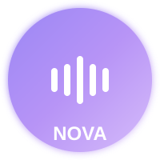

<div align="center">



# Nova - Your AI Voice Assistant


</div>

##  Overview

Nova is a modern, multilingual AI voice assistant that brings natural conversation to your browser. With support for English, Arabic, and French, Nova makes interaction seamless and intuitive.

##  Features

-  **Multilingual Support**
  - English (US)
  - Arabic (Lebanese)
  - French

-  **Key Capabilities**
  -  Beautiful, responsive blob visualization
  -  Real-time language switching
  -  Powered by advanced AI models
  -  Natural voice synthesis
  -  Accurate speech recognition

-  **User Experience**
  -  Smooth animations and transitions
  -  Dynamic color changes
  -  Fully responsive design
  -  Click or voice activation

##  Getting Started

1. **Clone the Repository**
   ```bash
   git clone https://github.com/naveed-gung/nova.git
   cd nova
   ```

2. **Install Dependencies**
   ```bash
   npm install
   ```

3. **Set Up Environment Variables**
   Create a `.env` file with:
   ```env
   VITE_GEMINI_API_KEY=your_gemini_api_key
   VITE_HUGGING_FACE_API_KEY=your_huggingface_api_key
   ```

4. **Start Development Server**
   ```bash
   npm run dev
   ```

##  Voice Commands

- **English**
  - "Switch to Arabic"
  - "Switch to French"
  - Ask any question!

- **Arabic**
  - "تكلم انجليزي" (Speak English)
  - Ask questions in Arabic!

- **French**
  - "Passer à l'anglais" (Switch to English)
  - Ask questions in French!

##  Tech Stack

-  React + TypeScript
-  Tailwind CSS
-  Google Gemini API
-  Hugging Face Models
-  Web Speech API
-  Vite

##  Features in Detail

###  Dynamic Blob Visualization
- Responds to voice input
- Changes color based on state
- Smooth animations

###  Language Support
- Seamless language switching
- Natural voice synthesis
- Accurate speech recognition

###  AI Integration
- Smart context handling
- Natural language processing
- Quick response times


###  Made with Love and AI

[Live Demo](https://n0v0.netlify.app/) 

</div>
